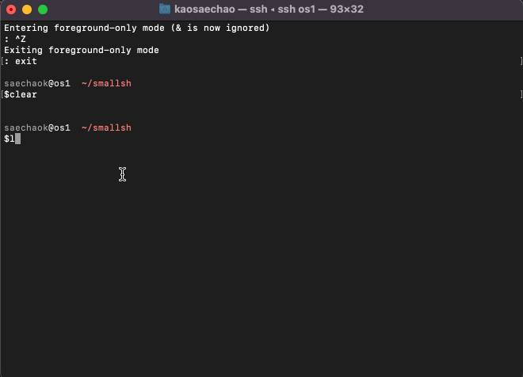

# CS344_smallsh
CS344 Portfolio Project

CS344 portfolio project written in C to replicate some of the commands of a shell. The program runs on the command line and executes the basic commands such as ‘ls’, ‘mkdir’, ‘ps’, etc. The program will allow for continuous forking of child processes ad foreground and background, with the parent killing the background child processes as the finish.

The program also supports custom signal handling for SIGINT and SIGTSTP.

The program compiles using 'gcc' and 'std=C99' flag. 

